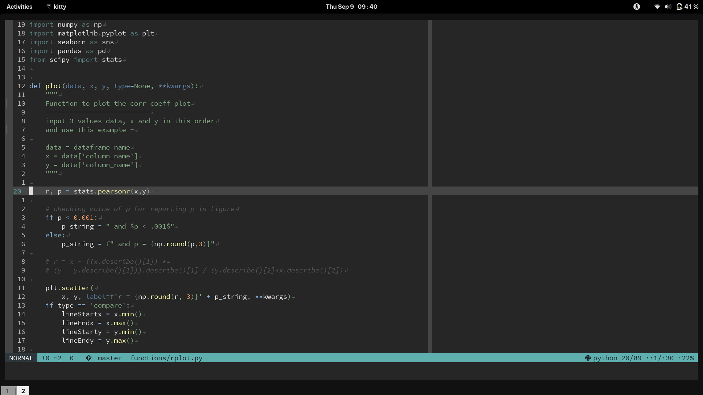

# apprentice.nvim

A pretty colorscheme for neovim written in `Lua` based on the [Apprentice](https://github.com/romainl/Apprentice) color pattete with support for `nvim-treesitter` and `neovim built-in lsp` which can be enabled using `setup()` function (please refer to [#Usage](https://github.com/adisen99/apprentice.nvim/tree/master#usage))

The basic structure and most of the code is inspired from the [gruvbox.nvim](https://github.com/npxbr/gruvbox.nvim) colorscheme written by [Ellison Leao](https://github.com/ellisonleao)

# Installation

**Requirements** - `apprentice.nvim` requires the `neovim v0.5` or greater to work.

Using `vim-plug`

```vim
Plug 'rktjmp/lush.nvim'
Plug 'adisen99/apprentice.nvim'
```

Using `packer`

```lua
use {"adisen99/apprentice.nvim", requires = {"rktjmp/lush.nvim"}}
```

# Usage

Inside `init.vim` (this does not support treesitter, built-in lsp, use the `init.lua` method below or wrap it between `lua << EOF ... EOF`)

```vim
set background=dark " or light if you want light mode
colorscheme apprentice
```

Inside `init.lua`
```lua
vim.o.background = "dark" -- or "light" for light mode

-- Load and setup function to choose plugin and language highlights
require('lush')(require('apprentice').setup({
  plugins = {
    "buftabline",
    "coc",
    "fzf",
    "gitgutter",
    "gitsigns",
    "lsp",
    "lspsaga",
    "nerdtree",
    "netrw",
    "nvimtree",
    "signify",
    "startify",
    "syntastic",
    "telescope",
    "treesitter"
  },
  langs = {
    "c",
    "clojure",
    "coffeescript",
    "csharp",
    "css",
    "elixir",
    "golang",
    "haskell",
    "html",
    "java",
    "js",
    "json",
    "jsx",
    "lua",
    "markdown",
    "moonscript",
    "objc",
    "ocaml",
    "purescript",
    "python",
    "ruby",
    "rust",
    "scala",
    "typescript",
    "viml",
    "xml"
  }
}))
```

If you want no plugin support then use colorscheme command instead -
```lua
vim.cmd(colorscheme apprentice)
```

**NOTE** - None of the plugins or languages highlights are enabled by default, the user is free to use the setup function to select which plugin highlights or language highlights they want to load.

# Configuration

- Setting the Contrast (hard, medium or soft)

```vim
lua vim.g.apprentice_contrast_dark = "medium"
" or
let g:apprentice_contrast_dark = "medium"
````

or

```vim
lua vim.g.apprentice_contrast_light = "soft"
" or
let g:apprentice_contrast_light = "soft"
```
**For more Configuration option** - go to the [CONFIGURATION](https://github.com/adisen99/apprentice.nvim/wiki/Configuration) page in the [WIKI](https://github.com/adisen99/apprentice.nvim/wiki)

# Additional supported plugins

- [vim-signify](https://github.com/mhinz/vim-signify)
- [vim-startify](https://github.com/mhinz/vim-startify)
- [nvim-tree](https://github.com/kyazdani42/nvim-tree.lua)
- [lspsaga.nvim](https://github.com/glepnir/lspsaga.nvim)
- [telescope.nvim](https://github.com/nvim-telescope/telescope.nvim)

# Screenshots

## dark mode

### hard contrast


### medium contrast (default)



### soft contrast


## light mode

### hard contrast


### medium contrast (default)


### soft contrast


# Contribution

This colorscheme is still in development and testing. Users are welcome to use it however for programming daily. In case a user spots any bugs or error especially related to the supported plugins, treesitter or built-in LSP highlight support, then they can contribute by opening an issue or by making a pull request. More plugin highlight support is also welcome.

#### HAPPY CODING :smile:
